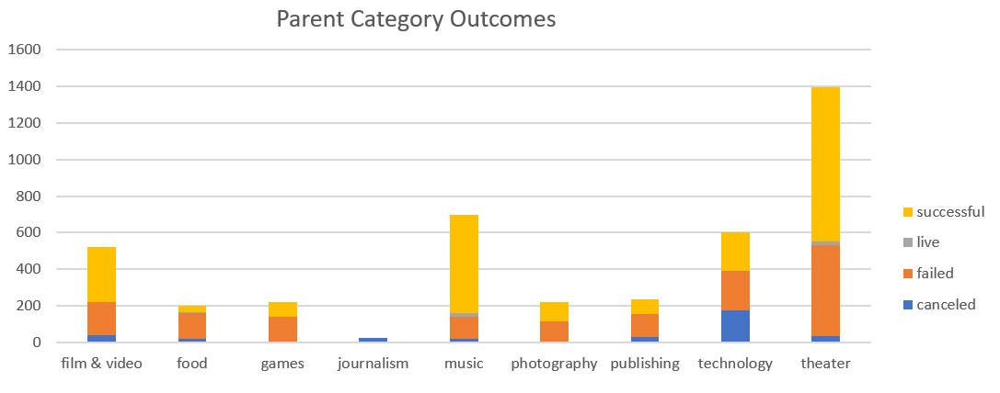
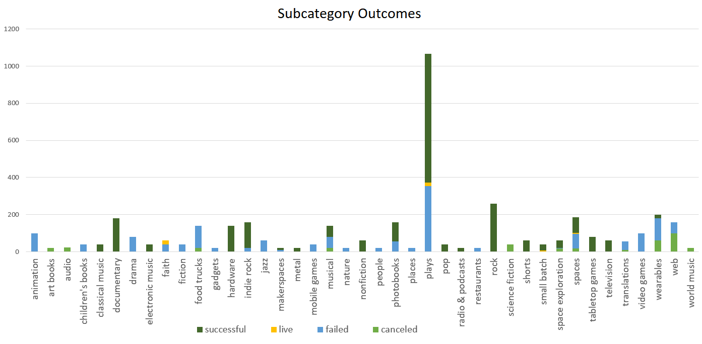
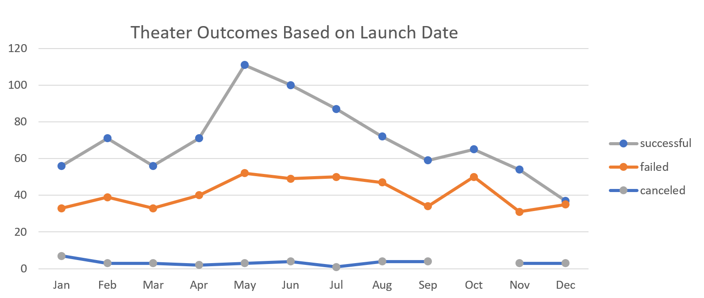
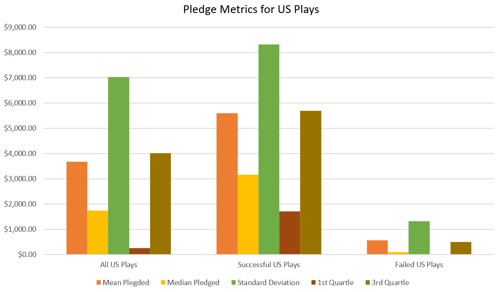
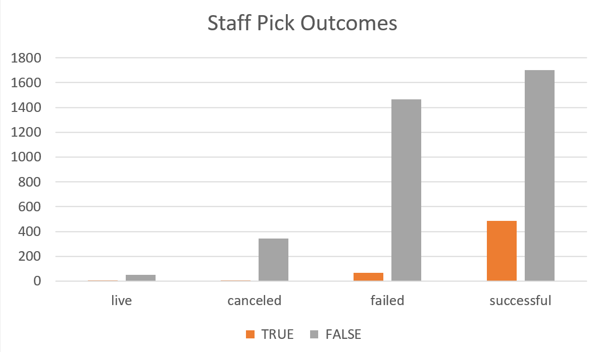
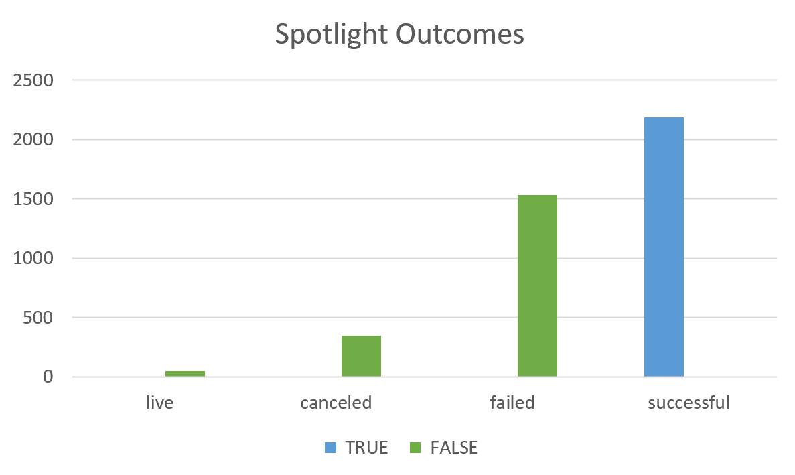

### Performing analysis on Kickstarter data to uncover trends

## Overview of Project
Perform analysis on Kickstarter data to uncover trends.

### Purpose
An up and coming playwright named Louise wants to start a crowdfunding campaign to help fund her play "Fever" and is estimating a budget just over $10,000.00. I am to analyze this Kickstarter dataset to and give her a plan for starting her crowdfunding campaign.

## Analysis and Challenges
The first pass of looking through the data provides a general overview to get a sense of what information is available and some basic statistics.

   

The most popular category is Theater and subcategory is Plays, accounting for 76% of all Campaigns.
The top 3 countries using Kickstarter for their crowdfunding are:
  1) United States with 3038 of 4114 Campaigns
  2) Great Britain with 604 of 4114 Campaigns
  3) Canada with 146 of 4114 Campaigns
  4) The remaining 326 campaigns are spread out among 20 countries

### Analysis of Outcomes Based on Launch Date

The data suggests May and June are the best times to launch a campaign because more projects have succeeded than any other month and December has the lowest success rate of all the months.

### Analysis of Outcomes Based on Goals

There seems to be some correlation between a projects' goals and their success, but not enough to draw any solid conclusions other than 1) less than $5,000 has the highest chance of success and 2) to stay below $45k.

### Challenges and Difficulties Encountered

Everything until this point has been guidelines to improve your chances of success with a crowdfunding campaign. Starting with the assumption you had a 50/50 chance of success from the start, now it feels more like a 60/40 chance. However there is no clear piece of information that points to a potential explanation that really gives an edge over other projects.

Diving into the financial information for the pledges did reveal some interesting data. When averaged together there is a drastic difference between failure and success, this difference cannot be explained away as "They are just asking for too much money." Crowdfunding is intended to gather alot of small donations to reach an large financial goal, not from just one person. This means that alot of people need to see your project, visibility of your project plays a large role in it's success.

 

The graph shows the percentage of projects with 10+ backers versus less than 10 for several levels of filtering. These numbers show that the projects that failed had a visibility problem. Within the dataset, there are two sections that relate to visibility: "Staff Pick" and "Spotlight". Staff Pick is a project specifically promoted by an employee, they send emails about it and do some marketing for that campaign; Spotlight is Kickstarter's automated promotion and recommender system.

The spotlight feature is far more effective than anticipated, 100% successful when used. This was a huge surprise... Staff picks has little bearing on success or failure, I was expecting the staff picks to provide some effect on the visibility. The projects that were staff picks and did not use the spotlight feature failed.

## Results

Launch the funding campaign in May or June for the anticipated budget and use Kickstarter's spotlight feature.

- What are some other possible tables and/or graphs that we could create?
  - Could compare the length of the campaigns versus their outcome and staring month.

- What are some limitations of this dataset? 
  - This is very general information I would like more granular data. For Example: How many pledge levels and their dollar value amounts, the number of backers for those pledge levels, how many backers pledged each day and what day in the length of the campaign did the project become successful. With those we'd be able to find the best price points of pledge levels for Louise's funding campaign and have a better view of how visible different campaigns are.
